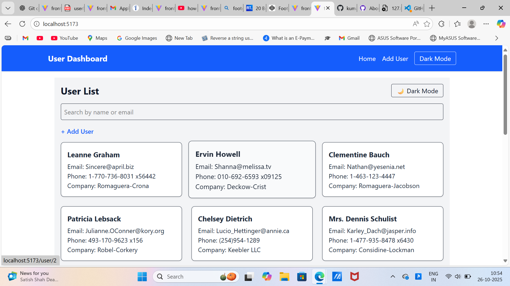
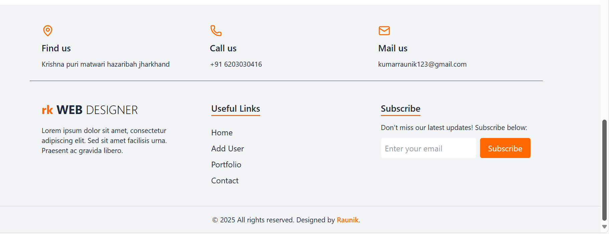

# User Management Dashboard

A simple React.js User Management Dashboard where you can:
- Add new users
- View user details
- Switch between light/dark mode
- Get toast notifications

## 🛠️ Technologies Used
- React.js
- Tailwind CSS
- react-router-dom
- react-hot-toast

## 🚀 How to Run
```bash
npm install
npm run dev
src/
 ┣ components/
 ┃ ┗ Navbar.jsx
 ┃ ┗ Footer.jsx
 ┣ pages/
 ┃ ┗ Home.jsx
 ┃ ┗ AddUser.jsx
 ┃ ┗ UserDetails.jsx
 ┣ App.jsx
 ┗ main.jsx

 ## 📸 Screenshots


### 📊 Dashboard


### Add User


### Add User in Dark Mode


### Validation With Toster


### Footer 


